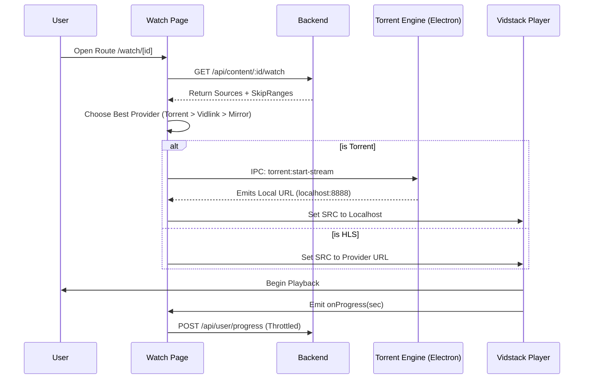

# Watch Pipeline (SPEC-WATCH-PIPELINE)

## 1. Unified Watch API

**Endpoint**: `GET /api/content/:id/watch`

### Request Parameters
- `id`: Content ID.
- `episodeId` (optional): Specific episode ID for series/anime.

### Response Shape
```json
{
  "content": {
    "title": "Jujutsu Kaisen",
    "type": "anime",
    "tmdbId": 95479
  },
  "sources": [
    { "url": "magnet:?xt=...", "type": "torrent", "provider": "nyaa" },
    { "url": "https://vidlink.pro/...", "type": "hls", "provider": "vidlink" }
  ],
  "skipRanges": [
    { "type": "op", "start": 120, "end": 210 },
    { "type": "ed", "start": 1380, "end": 1470 }
  ],
  "subtitles": [
    { "lang": "en", "url": "...", "label": "English" }
  ]
}
```

## 2. Error Taxonomy

- `404`: Content not found in DB.
- `503`: Provider downtime (e.g., Vidlink API unreachable).
- `NO_SOURCES`: 200 OK but source array is empty. UX must show "Exhausted all mirrors" banner.

## 3. Component Responsibilities

| Responsibility | Page (`/watch/[id]`) | Player (`VidstackPlayer`) |
|----------------|----------------------|---------------------------|
| **Metadata** | ALWAYS fetches. | NEVER fetches. |
| **Provider Selection** | ALWAYS decides priority. | NEVER switches providers. |
| **Progress Persistence** | Manages periodic heartbeat. | Emits percentage events. |
| **Buffer Management** | N/A | Handles HLS recovery. |

## 4. Sequence Diagram: Streaming Flow


